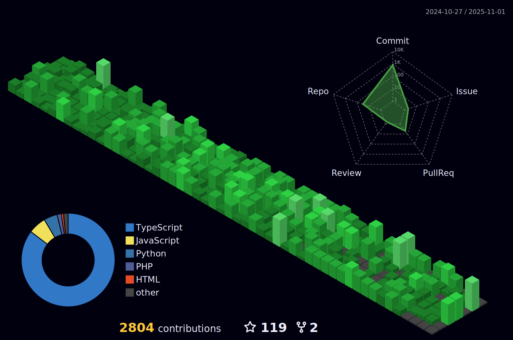

<h1 align="center">
    
</h1>

<h3 align="center">A passionate fullstack developer from Brasil - SC</h3>

 

 
 🔭 I’m currently working on **a marketplace**
 
 🌱 I’m currently learning **TurboRepo and DevOps**

💬 Ask me about **Node.js, React, mySQL... or anything [here](https://github.com/Faccin27/Faccin27/issues)**

⚡ Fun fact **Besides being a fullstack dev, I'm also an industrial automation technician.**

 

 

 
  
  
  
                 
  

 

 
<h2 align="center">⚒️ Languages-Frameworks-Tools ⚒️</h2>
 

    
     

 

<h2 align="center">⚡ Stats ⚡</h2>
 

  
  
   
  

  

 

 

